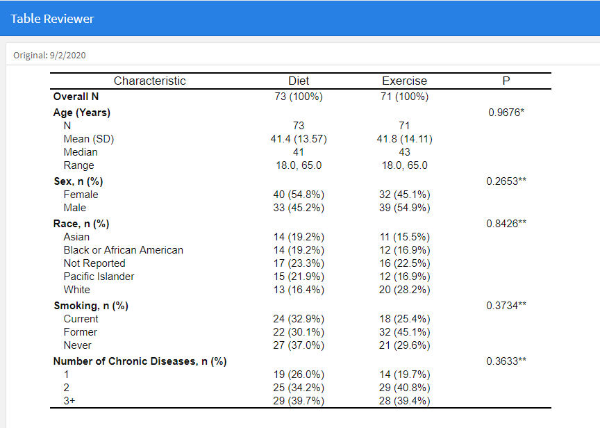

```{r setup, echo=FALSE, cache=FALSE}
library(knitr)
library(rmdformats)

## Global options
options(max.print="75")
opts_chunk$set(
	             cache=TRUE,
               prompt=FALSE,
               tidy=TRUE,
               comment=NA,
               message=FALSE,
               warning=FALSE)
opts_knit$set(width=75)
```


# Intro

In this guide, I'll share my learnings on how to leverage `diffdf` and `flextable` to spot differences between two data frames. I provide a real world use case that builds on the concepts presented at the end.

# From Scratch

I'll begin by creating two data frames that have slight differences. Assume that the cell values between the two data frames can differ while the number of observations (rows) and variables (columns) are similar.

```{r}
library(flextable)
library(diffdf)
library(dplyr)

df1 <- data.frame(id  = 1:5,
                  sex = c('m','f','f','m','f'),
                  smk = c('former','never','current','current','never'))

df2 <- data.frame(id  = 1:5,
                  sex = c('f','f','f','m','f'),
                  smk = c('former','never','current','former','never'))
```

We can create a flextable for each data frame quite easily.

```{r}
df1 %>% flextable()

df2 %>% flextable()
```

# Comparing with diffdf
The `diffdf` package can be used to find and return differences between two data frames. 

Below I create an object named `deltas` that will store the results of the `diffdf()` call on the two data frames I created. I've specified that df1 is the base (or "original") and that df2 is the comparator.

```{r}
deltas <- diffdf(base=df1, compare=df2)
```

The cell differences between the two data frames are stored in `deltas` as tibbles and are index by variable.

You may access them like so:
```{r}
#cell differences that involve the variable sex
deltas$VarDiff_sex

#cell differences that involve the variable smk
deltas$VarDiff_smk
```

Within each of the variable tibbles, the value of `VARIABLE` gives a natural column index, while the value of `..ROWNUMBER..` gives a row index. Together, these coordinates provide us a road map of precisely which cells in df2 differ from those in df1.

We need to extract, clean and store each variables results so that this information can be readily used for styling. In this example, I use a loop to account for many variables at once.

```{r}
#get variable names
var_list <- colnames(df1)

#create a place holder
delta_list <- list()

#iterate over variables to find if cell differences was detected - get "coordinates"
for(i in var_list) {
  dat <- data.frame(eval(parse(text=paste0("deltas$VarDiff_",i)))) %>% 
    janitor::clean_names()
  delta_list[[i]] <- dat
}

#put all found cell difference coordinates into a single data frame
delta_data = do.call(rbind, delta_list)

#view
delta_data
```

# Styling Differences
We can now use `delta_data` to style the flextable for df2. Below are a few examples of how to do this.

## Background colors
Change the background color for cells that differ.
```{r}
df2 %>% 
  flextable() %>%
  #Style rows individually from delta_data
  (function(x){
    for (i in 1:nrow(delta_data)) {
      #bg() is the flextable styling function
      x <- bg(x, 
              i=delta_data$rownumber[[i]], 
              j=delta_data$variable[[i]], 
              bg="yellow", 
              part="body")}
    x
  })()
```

`df1` side by side for comparisons.
```{r}
df1 %>%
  flextable()
```
 

## Cell Borders
Adding a border around cells that differ. Note: This requires the `officer` package. 

```{r}
library(officer)

df2 %>% 
  flextable() %>%
  #Style rows individually from delta_data
  (function(x){
    for (i in 1:nrow(delta_data)) {
      #border() is the flextable styling function
      x <- border(x, 
              i=delta_data$rownumber[[i]], 
              j=delta_data$variable[[i]], 
              #fp_border() is from officer
              border=fp_border(color = "orange", style="dashed", width=1.5), 
              part="body")
      }
    x
  })()
```

## Font Color
You can change the font color in a very similar way.
```{r}
df2 %>% 
  flextable() %>%
  #Style rows individually from delta_data
  (function(x){
    for (i in 1:nrow(delta_data)) {
      #color() is the flextable styling function
      x <- color(x, 
              i=delta_data$rownumber[[i]], 
              j=delta_data$variable[[i]], 
              color="red",
              part="body")
      }
    x
  })()
```

## Combining Styles
It's straight forward to combine styling functions using the pipe operator.

```{r}
df2 %>% 
  flextable() %>%
  #Style rows individually from delta_data
  (function(x){
    for (i in 1:nrow(delta_data)) {
      #piping together two flextable styling functions
      x <- border(x, 
              i=delta_data$rownumber[[i]], 
              j=delta_data$variable[[i]], 
              border=fp_border(color = "black", style="dashed", width=1.5), 
              part="body") %>%
           bg(x, 
                i=delta_data$rownumber[[i]], 
                j=delta_data$variable[[i]], 
                bg="skyblue",
                part="body")
      }
    x
  })()
```

# Extensions

The examples presented for in this tutorial were kept simple for demonstration purposes. Going beyond, the combination of `diffdf` and `flextable` together seem to have the potential to form a powerful work flow tool.

### diffdf
In addition to finding individual cell differences, you can also use `diffdf` to return other useful information such as the presence or absence of columns and rows. More examples can be found in the package  [vignette.](https://cran.r-project.org/web/packages/diffdf/vignettes/diffdf-basic.html)

### flextable
In flextable, you can use a variety of formatting techniques to draw attention to differences. I've attempted to demonstrate a few of them, and you can view other appraoches [here. ](https://davidgohel.github.io/flextable/articles/format.html) I found it very straight forward to test, adapt and combine different approaches due to the intuitive design of flextable. 


# Use Case

As part of my current responsibilities, I receieve pre-computed statistical tables that are saved as data sets (e.g. .sas7bdat, .csv). I import these into R as data frames for further processing. 

Given that this work flow is well established, I looked at whether comparisons between statistical tables were feasible with the approach outlined in this tutorial. One of the primary aims would be to detect changes between versions of pre-computed statistical tables. 

In the first panel, I have the initial version of a table.



In the second panel, I have an updated version of a table.


I've setup the following schema to highlight differences:

* Cell differences are in sky blue, with a boarder
* New columns are in pink, with a boarder
* New rows are highlighted in green
* I have a hardcoded a rule to highlight in yellow the prescence of `-9999` in the `P` column. 
  + The background for this cell is blue, because this cell value is also different from the original table.


If you are interested in the code for this example, you can view some of my progress [here](https://github.com/mattkumar/flexdiff).


Thanks!