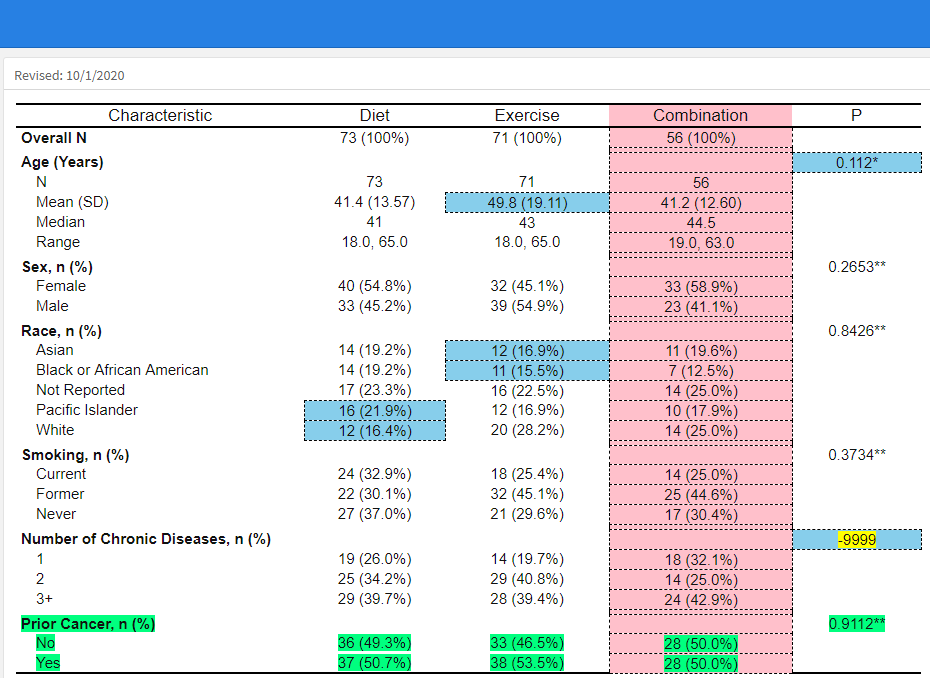

 ```{r setup, include=FALSE}
knitr::opts_chunk$set(echo = TRUE)
library(flextable)
library(diffdf)
library(dplyr)
```

# Intro
In this tutorial, I'll share my learnings on how to leverage `diffdf` and `flextable` to visualize differences between two data frames.

# From Scratch
Let's create two data sets that have slight differences. We'll assume only the cell values between the two data frames can differ, and that the number of observations (rows) and variables (columns) are similar.

```{r}
library(flextable)
library(diffdf)
library(dplyr)

df1 <- data.frame(id  = 1:5,
                  sex = c('m','f','f','m','f'),
                  smk = c('former','never','current','current','never'))

df2 <- data.frame(id  = 1:5,
                  sex = c('f','f','f','m','f'),
                  smk = c('former','never','current','former','never'))
```

We can create a flextable for each data frame quite easily.

```{r}
df1 %>% flextable()

df2 %>% flextable()
```

# Comparing with diffdf
Let's use the `diffdf` package to find and return differences between two data frames. 

Below I create an object named `deltas` that will store the results of the `diffdf` call. 

I've specified that `df1` is the base (or "original") and that `df2` is the comparator.

```{r}
deltas <- diffdf(base=df1, compare=df2)
```

Cell differences are stored in `deltas` as tibbles and are index by variable. You can accessed them like so:
```{r}
deltas$VarDiff_sex
deltas$VarDiff_smk
```

The value of `VARIABLE` gives a natural column index, while the value of `..ROWNUMBER..` gives the row index. Together, these coordinates provide us a road map of precisely what cells in `df2` differ from those in `df1`.

We'll need to extract, clean and store each variables results so that this information can be readily used. In this example, I use a loop to account for many variables at once.

```{r}
#get variable names
var_list <- colnames(df1)

#create a place holder
delta_list <- list()

#iterate over variables to find if cell differences was detected - get "coordinates"
for(i in var_list) {
  dat <- data.frame(eval(parse(text=paste0("deltas$VarDiff_",i)))) %>% 
    janitor::clean_names()
  delta_list[[i]] <- dat
}

#put all found cell difference coordinates into a single data frame
delta_data = do.call(rbind, delta_list)

#view
delta_data
```

# Visualizing Differences
We can now use `delta_data` to style the flextable for `df2`. I've chosen set the background color of cells in `df2` to yellow to demonstrate cell differences.

```{r}
df2 %>% 
  flextable() %>%
  #Style rows individually from delta_data
  (function(x){
    for (i in 1:nrow(delta_data)) {
      x <- bg(x, 
              i=delta_data$rownumber[[i]], 
              j=delta_data$variable[[i]], 
              bg="yellow", 
              part="body")}
    x
  })()

df1 %>%
  flextable()

```


# Extensions

The example presented for in this tutorial was very simple and for demonstration purposes. Going forward, the combination of `diffdf` and `flextable` together have the potential to form a powerful work flow for many applications.

### diffdf
In addition to finding individual cell differences, you can also use `diffdf` to return other useful information such as the presence or absence of columns and rows. More on the `diffdf` package can be found [here.](https://cran.r-project.org/web/packages/diffdf/vignettes/diffdf-basic.html)

### flextable
In flextable you can use a variety of formatting techniques to draw attention to differences. For example, font (color, size, face) and cell (borders) properties, [among others,](https://davidgohel.github.io/flextable/articles/format.html) can be configured in a straight forward way due to the intuitive design of flextable.


# An Example ...in progress

In some environments, statistical output are created and exported by programming staff in software other than R. These results are usually provided to the team responsible for writing the study report or performing quality checks. As this process is usually iterative, differences between rounds of results are likely to exist. 

The prototype is intended to help the writing team review and spot differences tables in an interactive fashion. This is somewhat predicated on the statistical tables being standardized (i.e. predictable) in nature.


Below is the original table. The table file was initially provided as a CSV.


Below is an updated table.



mark { 
  background-color: yellow;
  color: black;
}

Cell differences are <mark>highlighted</mark>, while additional <span style="color: red;">columns</span> and <span style="color: orange;">text</span> are color coded for identification.


If you are interested in the prototype, you can view some of my progress [here](https://github.com/mattkumar/flexdiff)

Thanks!